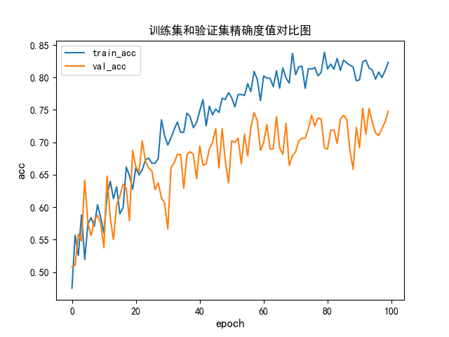

# Refining AlexNet: A Deep Dive into CNN Architecture and Optimization

## 1. Project Overview
This repository contains a scratch-built, optimized replication of the classic **AlexNet** architecture for binary image classification (Dogs vs. Cats). 

While modern models like YOLO or ResNet are often used today, I initiated this project to systematically study the fundamental building blocks of Convolutional Neural Networks (CNNs). The primary goal is to address common deep learning challenges—such as **overfitting**, **gradient vanishing**, and **generalization**—through modern optimization techniques.

## 2. Key Technical Implementations
Based on the original 2012 architecture, I introduced several critical modifications to adapt the model for contemporary datasets:

### A. Architectural Refinements (`Net.py`)
* **LeakyReLU Activation**: Replaced standard ReLU with `LeakyReLU (negative_slope=0.01)` to prevent the "dying ReLU" problem and ensure gradient flow during backpropagation.
* **Batch Normalization**: Integrated `nn.BatchNorm2d` after each convolutional layer to accelerate convergence and stabilize the learning process.
* **Regularization**: Added a `Dropout (p=0.5)` layer in the fully connected network to aggressively combat overfitting on the training set.

### B. Robust Data Augmentation (`train.py`)
To prevent the model from memorizing the background, I implemented a comprehensive data augmentation pipeline using `torchvision.transforms`:
* `RandomResizedCrop` & `RandomRotation(30)` for scale and rotational invariance.
* `ColorJitter` & `RandomGrayscale(p=0.1)` to force the model to learn structural features rather than relying purely on color profiles.

### C. Training Strategy
* Implemented an **LR Scheduler** to dynamically decay the learning rate, allowing the model to escape local minima in the early stages and converge finely in the later epochs.

## 3. Experimental Results & Analysis

### Performance Metrics
* **Validation Accuracy**: 83.5%
* **Convergence Epoch**: Epoch 78

### Training Dynamics (Loss & Accuracy Curves)
*(The narrow gap between the training and validation loss curves indicates that the heavy data augmentation and dropout successfully prevented severe overfitting.)*



## 4. Engineering & Deployment
I structured the codebase to be modular and deployable, demonstrating good engineering practices:
* **`Net.py`**: Model definition.
* **`train.py`**: Training loop with automatic learning rate logging.
* **`test.py`**: A deployment-ready inference script that not only outputs predictions but also visualizes a grid comparing `Ground Truth` vs `Prediction` for intuitive debugging.

## 5. How to Run
```bash
# 1. Install dependencies
pip install torch torchvision matplotlib pillow

# 2. Train the model
python train.py

# 3. Run Inference and Visualization
python test.py
